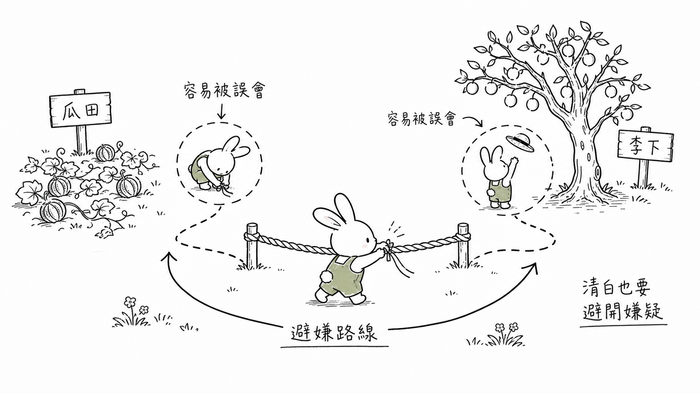
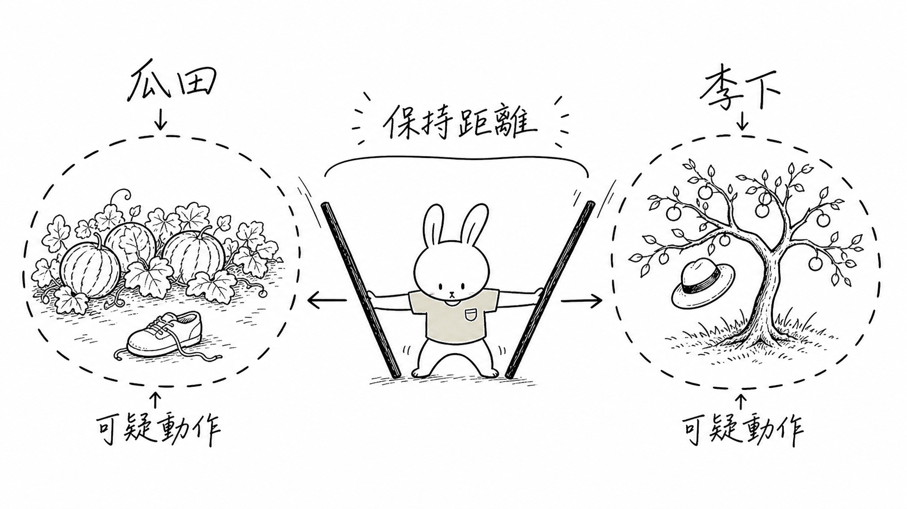
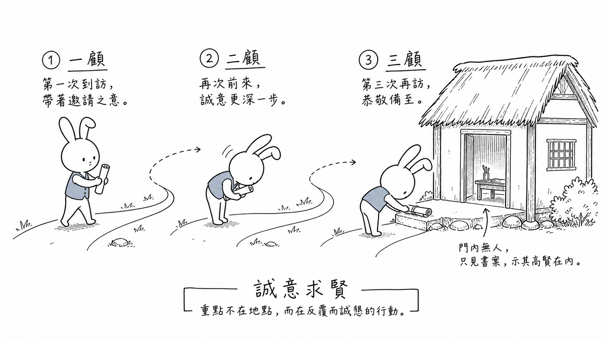
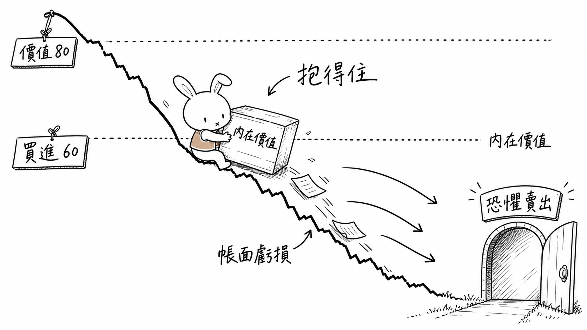

# Figure Skill

Figure Skill 可以把整篇文章或一個段落做成白底 + 手繪線稿風格的解釋型配圖

它的用途不是拿來產生文章封面，而是幫助讀者快速抓住段落裡最重要的思考結構，像是流程、狀態變化、比較、方法、系統關係與決策結構等。

呈現的形式是一隻固定的無表情兔子為主角，搭配簡單的線條和少量色塊。

## 特色

- 將文章段落收斂成單一核心觀點
- 支援流程、狀態變化、比較、方法、系統關係與決策結構等多種圖解類型
- 使用固定兔子 IP：無表情臉、動作可誇張、有冷面搞笑感

## 適合用在

- 技術概念圖解
- 產品方法論配圖
- 文章段落視覺化
- 流程與系統關係圖
- 教學內容的概念插圖
- 社群貼文或簡報裡的解釋型圖像

## 適用模型

推薦使用 **Codex** 和 **Antigravity CLI**，因為它們對於圖像 prompt 的理解和生成能力較強，而且內含生圖模型

## 安裝

使用 `npx skills add` 指令安裝 Figure Skill：

```bash
npx skills add mukiwu/figure
```

## 使用方式

在 Codex 或支援 Agent Skills 的工具中，輸入 `/figure` 並貼上要視覺化的內容

輸入成語請他做成視覺配圖：

```text
/figure 瓜田李下
```

Codex：

[](./assets/ig_078292d6be61dc78016a1d030cd8ac8191b163c00826772056.png)

Antigravity：

[](./assets/guatian_lixia_1780284633691.png)

---

```text
/figure 三顧茅廬
```



---

或者是輸入一個段落：

```text
/figure
估對價值還不夠，你還得「抱得住」
這是本章最反人性的部分。馬克斯說，就算你算出某股價值 80 元、用 60 元買進（巴菲特說的「用五角買進好幾元的東西」），你常常會發現自己是在持續下跌的過程中買進，很快就看到帳面虧損。
他點出一個違反經濟學直覺的現象：商店特價時人們搶買，但投資界價格漲時大家更愛、價格跌時大家更怕。「最危險的想法」是：「已經跌太多了，我最好在股票變壁紙前趕快脫手」——這就是讓股票破底、引發瘋狂賣壓的思維。
```



---

也可以提供一份完整的檔案，會依照 Figure Skill 規則整理成 5-8 張 shot list

```text
/figure {文章附件或連結}
```

這個範例生成了 6 張 shot list


## 更新 Skill

安裝後如要更新：

```bash
npx skills update figure -g
```
